# Ejercicio 1

1) Clonar el proyecto
2) Por consola ir a @usuario:cd ~/MB/MB_Ejercicio1
3) Ingresar a app.js y en let adn pasar el array de adns
4) Correr node app.js

##### Se verá lo siguiente:
###### Secuencia de mutante: ["ATGCGA", "CAGTGC", "TTATGT", "AGAAGG", "CCCCTA", "TCACTG"]
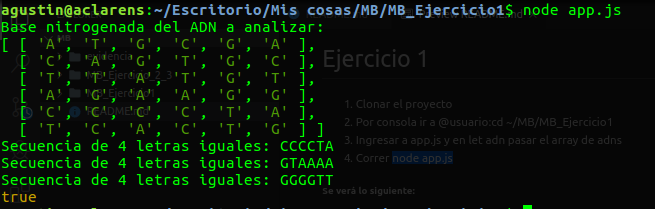

###### Secuencia de NO mutante: ["ATGCGA", "CAGTGC", "TTATTT", "AGACGG", "GCGTCA", "TCACTG"]
En app.js comentarear la linea de mutante: let adn = ["ATGCGA", "CAGTGC", "TTATGT", "AGAAGG", "CCCCTA", "TCACTG"];
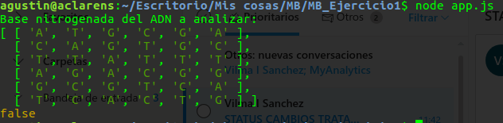

# Ejercicio 2 y 3
Tecnologias necesarias:
- NodeJs
- npm
- Postman
- Docker
- Mongodb
- Robo mongo (en caso de no querer trabajar por consola con la base de datos)

## Crear la base de datos (explicación por consola):
1) Iniciar mongo: ~$ sudo systemctl start mongodb
2) ~$ mongo
2) > use mutantesDb
3) > db.mutantes.save({adn:'prueba' })
4) > db.mutantes.find(): 
Devolverá: { "_id" : ObjectId("5e2ef0b415381bcc684b06e0"), "adn" : "prueba" }
##### Se verá lo siguiente:
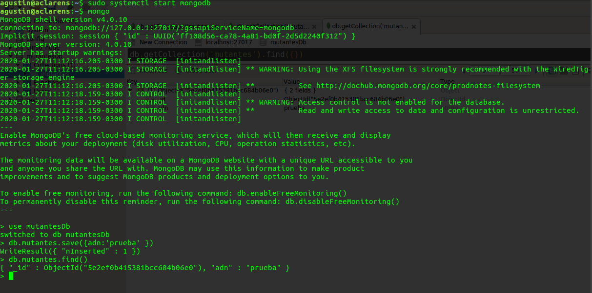

En base de datos:
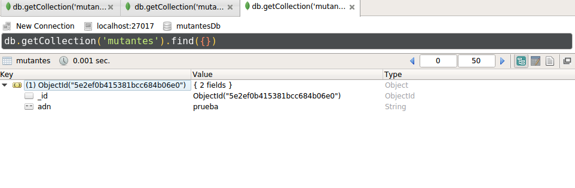

## Proyecto:
1) Clonar el proyecto
2) Por consola ir a @usuario:cd ~/MB/MB_Ejercicio_2_3
3) correr npm start (se dejan los node_modules en el proyecto aunque es recomendable no hacerlo, lo que se tendría que hacer es primero correr npm install siempre y cuando se tenga el archivo package.json con las dependencias correspondientes)
##### Se verá lo siguiente:
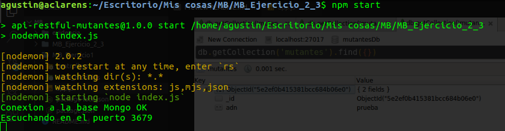

4) Ingresar a postman 
5) URL para post: http://localhost:3679/api/mutante
6) body: {
"dna":[
	"ATGCGA",
	"CAGTGC",
	"TTATGT",
	"AGAAGG",
	"CCCCTA",
	"TCACTG"
	]
}

7) Click en send

#### Se verá lo siguiente:

##### ADN mutante:
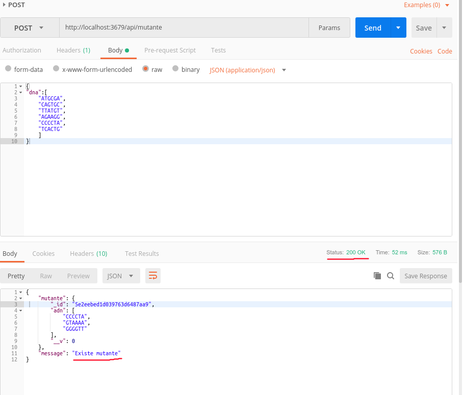

##### ADN no mutante:
body: {
{
"dna":[
	"ATGCGA",
	"CAGTGC",
	"TTATTT",
	"AGACGG",
	"GCGTCA",
	"TCACTG"
	]
}

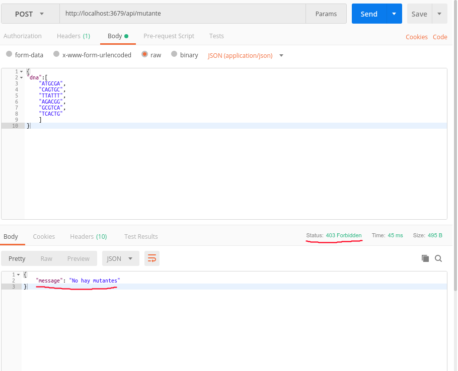

##### Luego de realizar los 2 post en consola se verá:
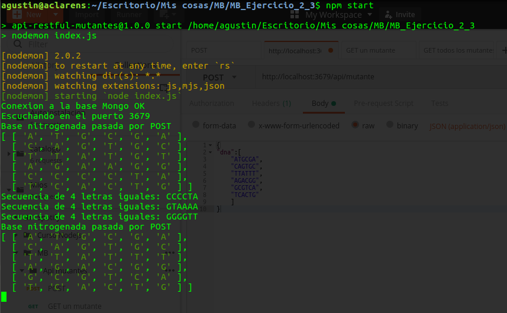

##### base de datos:
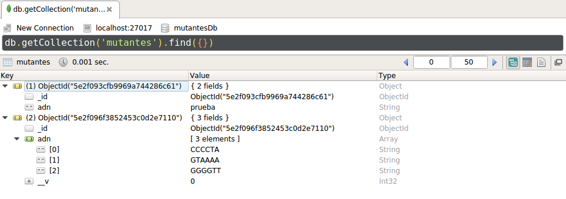

## Docker:
1) Posicionarse en el directorio de Docker: cd ~/MB/MB_Ejercicio_2_3/docker
2) Correr el comando: ~/MB/MB_Ejercicio_2_3/docker$ sh docker-deploy-local.sh <tag>
3) Correr el comando: ~/MB/MB_Ejercicio_2_3/docker$ sh docker-push.sh tag <tag>
Con estos dos pasos primero se subió el proyecto a Docker local y segundo a la registry
4) Entrar al server de docker: sudo ssh <usuario>@<servidor>
Suponiendo que ya existe una imagen (sino pasar al paso 8)
5) Detener el container anterior: docker stop apimutante
6) Eliminar el container: docker rm apimutante
7) Eliminar la imagen (en caso de que se quiera borrar): docker rmi dockerRegistry/apimutante:<tag>
8) Levantar el container: docker run -d --restart=always --name apimutante -p 3679:80 dockerRegistry/apimutante:<tag>

##### API get:
#### API get todos los mutantes (/api/getmutantes):
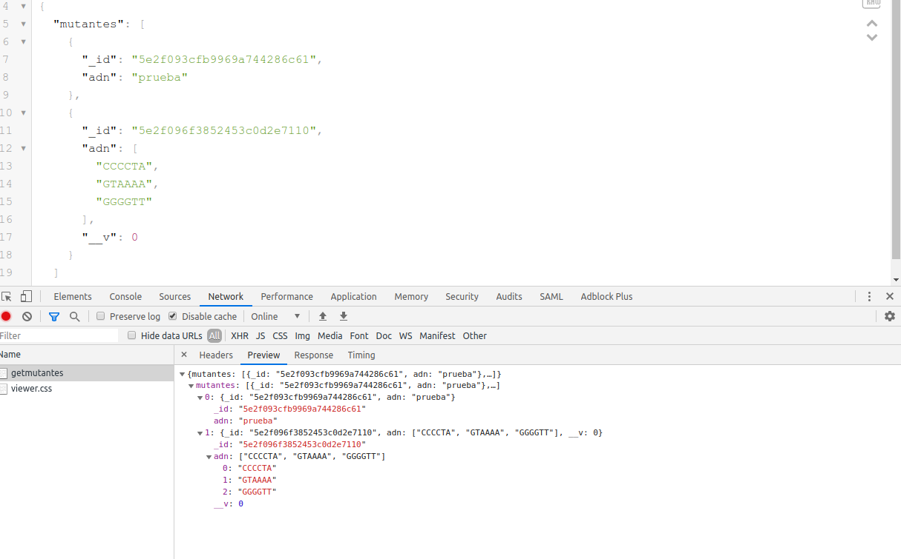

#### API get un mutante por ID de mongo(/api/getunmutante/<idmongo>):
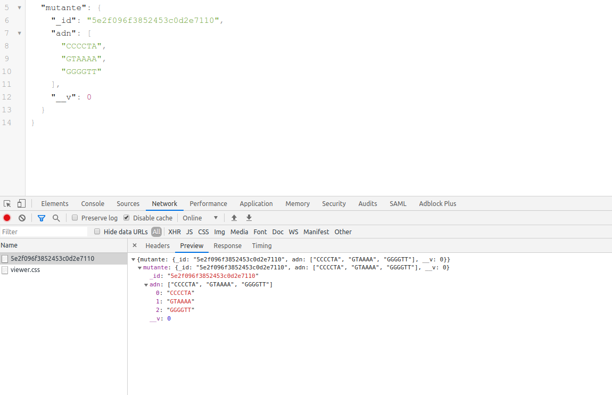

